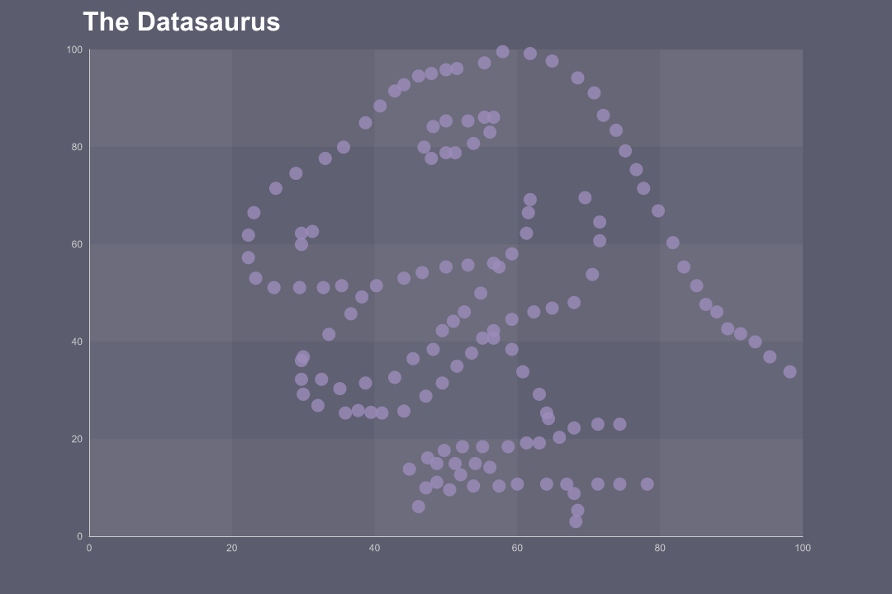
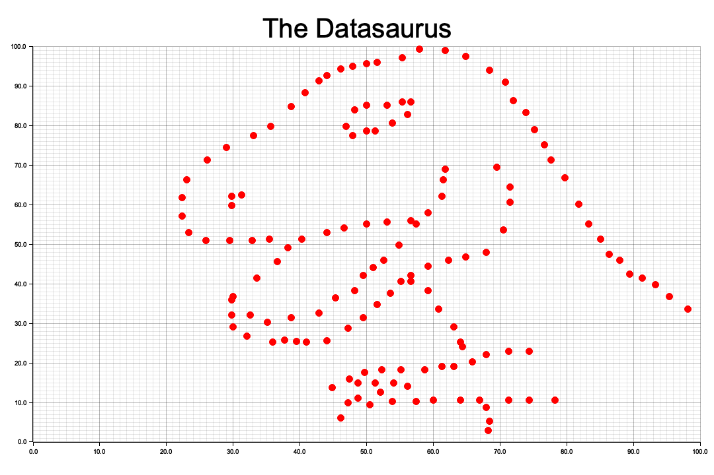

# chart_with_rust

This is a simple example of how to make graphs with Rust.

## Codes
- Charming: `src/charming_scatter.rs`
- Plotters: `src/plotters_scatter.rs`

## Images
- Charming: `output/datasaurus_charming.png`


- Plotters: `output/datasaurus_plotters.png`


## How to run

```bash
cargo run
```

## Check your graph

```bash
ls output
# datasaurus_charming.png datasaurus_plotters.png
```
